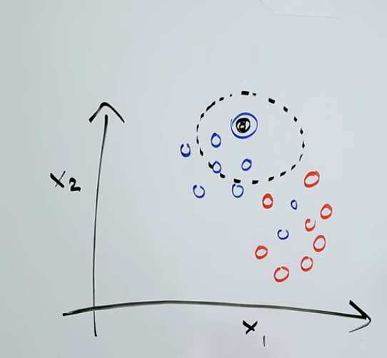
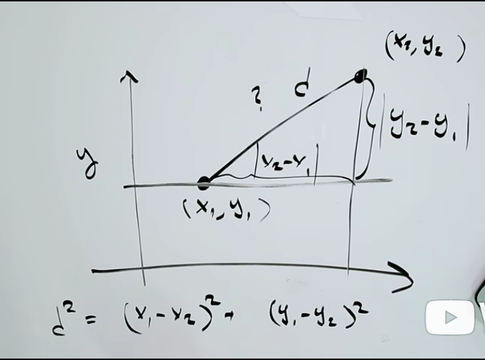

# 3.3.1 K nearest neighbours
- statistical learning is math and computation tools to understand data
- in supervised (machine) learning, goal is to estimate/predict output based on inputs(predictprs, independent variables, features etc)
- outputs are known as response variables, dependent variables etc...
- if the response is quantitative (ie numerical) these problems are called regression problems/regression analysis
- if the response is yes/no, true/false, blue/green etc then it is a classification problem
- k NN is a specific approach to classification
  - the goal is to set up a classifier so that when it is presented with a new observation whos category is unknown, it will attempt to assign tha observation to a category or class
  - it does this based on  the observations forwhich it *does* know the true category/vlass
  - given a +ve integer, k, and a new data point, it first identifies the k points in the data that are nerest to the new point and classifies the new data point as belonging to the most common class in those k neighbors
  - 
 
# 3.3.2 Euclidean distance btwn 2 points
- 
- distance between x1,y1 and x2, y2 is sqrt( (x1-x2)**2 + (y1-y2)**2 ) so the root of the sum of the absolute distance sqaured between the two x coords and the two y coords.
- we can represent this as row vectors in numpy (or column vectors but row vectors are easier)
```py
def distance(p1, p2):
  """Find the distance beteen ponts p1 and p2 """
  import numpy as np
  return np.sqrt(np.sum(np.power(p2 -p1, 2)))
```
# 3.3.3 majority vote

- if we want to make a kNN fn we need to beable to compute the 'majority vote' or how often a certain val occurs
- for example, if we have two 1s, three 2s and two 3s we wuld want to return 2. (is this not the mode?)
(this is the mode but we will be wanting the nearest neighbours so we actually need to count all categories)
- we are going to start building this from our basis of the (slow) count words fn which was:

```py
def count_words(text):
  text = text.lower()
  skips = [".", ",", ";", ":", "'", '"']
  for punct in skips:
    text = text.replace(punct, '')
  word_counts = {}
  for word in text.split():
    if word in word_counts:
      word_counts[word] += 1
    else:
      word_counts[word] = 1
  return word_counts 
```

and we get:
```py
def majority_vote(votes):
  vote_counts = {}
  for vote in votes:
    if vote in vote_counts:
      vote_counts[vote] += 1
    else:
      vote_counts[vote] = 1
  return vote_counts 

# to find the most values:
max_count = max(vote_counts.values())
```

Note that max_count would return say 9, of the thing that occured most, occured 9 times. It doesn't actually tell us WHAT that thing is and THAT is what we want to know. For this we need to use `items`

- Note that while this method is commonly called "majority vote," what is actually determined is the plurality vote, because the most common vote does not need to represent a majority of votes. We have used the standard naming convention of majority vote here.

# We could have just used numpy mode
- it is in the mstats module in scipy stats

#3.3.4 kNN
- we want a function that for any given point computes the k NNs for that point
###pseudocode
for any given NEW point:
1) loop over all the existing points
2) for any of the points, compute the distance between it and the new point
3) sort the distances and return the k number of points CLOSEST to our new point
4) find out what the majority of those k points are classified as and assign this category to new point

#3.3.5 Generating synthetic data
- see scipy ipstats module
- bivariate eg 2 variables x and y

#3.3.6 making a prediction grid
- meshgrid takes a tuple. It contains two 1d np array of values such as (array([0, 1, 2, 3, 4]) , array([0, 1, 2, 3, 4, 5]))
- what this would do is it would crate a grid where x values from 0 to 4 and y values 0 to 5 (in this case) and create an xy point for every intersection on that grid. BUT the output is strange...

In [415]: xs
Out[415]: array([0, 1, 2, 3, 4])

In [416]: ys = np.arange(0,6,1)

In [417]: ys
Out[417]: array([0, 1, 2, 3, 4, 5])

In [418]: np.meshgrid(xs,ys)
Out[418]:
[array([[0, 1, 2, 3, 4],
        [0, 1, 2, 3, 4],
        [0, 1, 2, 3, 4],
        [0, 1, 2, 3, 4],
        [0, 1, 2, 3, 4],
        [0, 1, 2, 3, 4]]), array([[0, 0, 0, 0, 0],
        [1, 1, 1, 1, 1],
        [2, 2, 2, 2, 2],
        [3, 3, 3, 3, 3],
        [4, 4, 4, 4, 4],
        [5, 5, 5, 5, 5]])]

In [419]: xx, yy = np.meshgrid(xs,ys)

In [420]: xx
Out[420]:
array([[0, 1, 2, 3, 4],
       [0, 1, 2, 3, 4],
       [0, 1, 2, 3, 4],
       [0, 1, 2, 3, 4],
       [0, 1, 2, 3, 4],
       [0, 1, 2, 3, 4]])

In [421]: yy
Out[421]:
array([[0, 0, 0, 0, 0],
       [1, 1, 1, 1, 1],
       [2, 2, 2, 2, 2],
       [3, 3, 3, 3, 3],
       [4, 4, 4, 4, 4],
       [5, 5, 5, 5, 5]])


- what we get is one array containing all the x values and one containg every y value

#3.3.7
- plot prediction grid is provided:

```py
def plot_prediction_grid (xx, yy, prediction_grid, filename):
    """ Plot KNN predictions for every point on the grid."""
    from matplotlib.colors import ListedColormap
    background_colormap = ListedColormap (["hotpink","lightskyblue", "yellowgreen"])
    observation_colormap = ListedColormap (["red","blue","green"])
    plt.figure(figsize =(10,10))
    plt.pcolormesh(xx, yy, prediction_grid, cmap = background_colormap, alpha = 0.5)
    plt.scatter(predictors[:,0], predictors [:,1], c = outcomes, cmap = observation_colormap, s = 50)
    plt.xlabel('Variable 1'); plt.ylabel('Variable 2')
    plt.xticks(()); plt.yticks(())
    plt.xlim (np.min(xx), np.max(xx))
    plt.ylim (np.min(yy), np.max(yy))
    plt.savefig(filename)
```
## Bias variance tradeoff
looking at the plots you might think ok, well a smallish k (5) gives a pretty accurate idea of what my point should be and so k=1 would be even better because a k=50 plot isn't very precise at all...

BUT actually a k thats too small is as bad as a k thats too large. In this case k=5 is pretty good.

# 3.3.8 applying kNN
- using the ron fisher dataset from 1933 about flowers
- 150 irises, 50 from each of 3 species
- each flower has the covariates sepal length, sepal width and petal lenth, petal width
- can use SciKitLearn lib to import datasets


